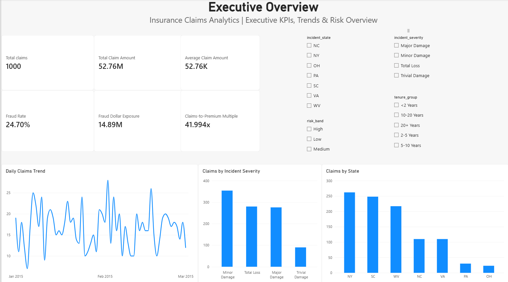
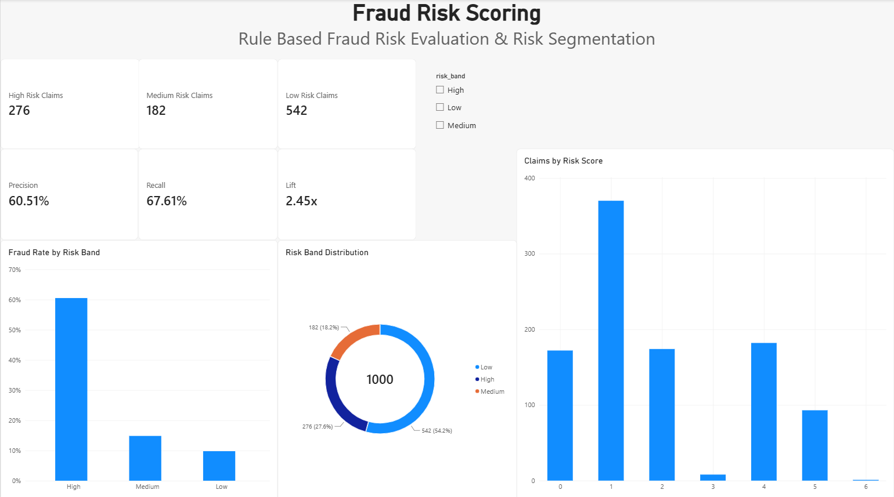
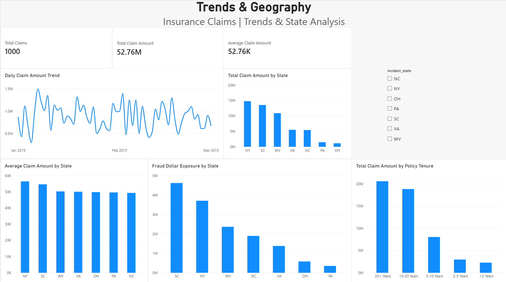

# Insurance Claims Analytics Pipeline (Star-Schema Data Mart)
[](https://www.postgresql.org/)
[](https://www.docker.com/)
[](https://www.python.org/)
[]()
[]()
An end-to-end insurance claims analytics project: a Python ETL pipeline loads a public auto-insurance claims dataset into a PostgreSQL Kimball-style dimensional model (star schema), with SQL analysis, a transparent rule-based fraud risk score and a Power BI dashboard. Built as a data analytics portfolio project; read the [Limitations](#10-limitations) before interpreting any number.
---
## 1. Executive Summary & Key Metrics
All figures below were computed by running SQL queries against the populated PostgreSQL warehouse (`core.fact_claims` and the dimensional views):
| Core KPI | Verified Value | Actuarial & Business Context |
| :--- | :--- | :--- |
| **Analyzed Claim Population** | **1,000 records** | Full historical snapshot from `data/raw/insurance_claims.csv` |
| **Unique Insured Policies** | **1,000 policies** | 1:1 policy-to-claim event mapping |
| **Total Incurred Claims Loss** | **$52,761,940.00** | Cumulative gross claim liability across all categories |
| **Average Claim Severity** | **$52,761.94** | Mean financial loss per claim |
| **Total Annual Premium** | **$1,256,406.15** | Sum of one year of premium across the 1,000 policies |
| **Claims-to-Premium Multiple** | **41.99x** | Total claims ÷ total annual premium. A relative risk indicator, **not** an actuarial loss ratio (see [Limitations](#10-limitations)) |
| **Reported Fraudulent Claims** | **247 claims** | `fraud_reported = 'Y'`, a flag in the source data and not a verified outcome |
| **Overall Fraud Frequency** | **24.70%** | ~1 in 4 claims carries the fraud flag (unusually high; see Limitations) |
| **Fraud Dollar Exposure** | **$14,894,620.00** | **28.23%** of all claim dollars sit on claims carrying the fraud flag |
| **Claim Breakdown: Vehicle Damage** | **$37,928,950.00** | **71.89%** of all claim payouts |
| **Claim Breakdown: Bodily Injury** | **$7,433,420.00** | **14.09%** of all claim payouts |
| **Claim Breakdown: Property Damage**| **$7,399,570.00** | **14.02%** of all claim payouts |
---
## 2. Dataset Profile & Engineering Design Decisions
The data is the public Kaggle dataset [Auto Insurance Claims Data](https://www.kaggle.com/datasets/buntyshah/auto-insurance-claims-data) (`data/raw/insurance_claims.csv`, 1,000 rows × 40 columns). Check the dataset page for its license and terms before reusing it.
**Data quality auditing:** the pipeline runs 14 checks after each load and appends the results to `audit.data_quality_audit` under a new `run_id`, so audit history is retained across runs. The expected row count and the expected number of `'None'` values in `authorities_contacted` are counted from the source file that was loaded, not hard-coded.
### Key Engineering Decisions & Adaptations
1. **Handling Missing Identifier Columns (`claim_id` & `customer_id`):**
   * *Dataset Reality:* The raw dataset has no standalone `claim_id` or `customer_id` column.
   * *Design Decision:* `policy_number` is the natural key of the whole model (it is unique in the source and the loader refuses a file where it is not). Integer surrogate keys (`customer_key`, `policy_key`, `incident_key`, `vehicle_key`, `claim_key`) are `SERIAL` columns assigned by PostgreSQL, not by Python. `claim_id` (`CLM-10001`, `CLM-10002`, ...) is a business label given to **new** claims only, continuing after the current maximum, so an existing claim keeps its `claim_id` for good. See [Incremental Load](#8-incremental-load).
2. **Elimination of Trailing Delimiter Artifact (`_c39`):**
   * *Dataset Reality:* The raw CSV contains trailing commas on every record line, causing standard parsers to generate a 40th column (`_c39`) with 100% missing values (1,000/1,000 NaNs).
   * *Design Decision:* Dropped `_c39` during ingestion in `src/transform.py`.
3. **Clamping Numeric Entry Anomalies (`umbrella_limit`):**
   * *Dataset Reality:* Record index 290 (`policy_number` 526039) contains an impossible negative umbrella liability limit (`umbrella_limit = -1000000`).
   * *Design Decision:* Clamped negative values to `$0` to protect downstream aggregations while logging the data quality anomaly.
4. **Resolution of Hidden Sentinel Nulls (`?`):**
   * *Dataset Reality:* Categorical columns `property_damage` (360 rows), `police_report_available` (343 rows), and `collision_type` (178 rows) contain `'?'`.
   * *Design Decision:* Standardized `'?'` to `'UNKNOWN'`, with `collision_type` mapped to `'Not Applicable'` for non-collision incidents (`Parked Car` and `Vehicle Theft`).
5. **Preserving Categorical `'None'` in Law Enforcement Data:**
   * *Dataset Reality:* 91 records have `authorities_contacted = 'None'`. Default CSV parsers coerce the string `'None'` to `NaN`.
   * *Design Decision:* Configured parser with `keep_default_na=False` to retain `'None'` as a distinct, valid category indicating no emergency services were dispatched.
6. **Typographical Corrections in Vehicle Master Data:**
   * *Dataset Reality:* Misspellings in `auto_make` (`"Suburu"`: 80 rows, `"Accura"`: 68 rows) and `auto_model` (`"Forrestor"`).
   * *Design Decision:* Corrected to `"Subaru"`, `"Acura"`, and `"Forester"` during staging transformation.
7. **Column Header Normalization:**
   * Standardized kebab-case columns `capital-gains` $\rightarrow$ `capital_gains` and `capital-loss` $\rightarrow$ `capital_loss`, and corrected `policy_deductable` $\rightarrow$ `policy_deductible`.
---
## 3. Kimball Dimensional Star Schema
The warehouse models the claims process as a Kimball-style dimensional model (star schema) in PostgreSQL:
```
                            +-----------------------+
                            |     core.dim_date     |
                            +-----------------------+
                            | PK  date_key          |
                            |     full_date         |
                            |     year, quarter     |
                            |     month, day        |
                            |     day_of_week       |
                            |     is_weekend        |
                            +-----------+-----------+
                                        |
                                        | (incident_date_key)
+-----------------------+               |               +-----------------------+
|   core.dim_customer   |               |               |    core.dim_policy    |
+-----------------------+               |               +-----------------------+
| PK  customer_key      |               |               | PK  policy_key        |
|     policy_number(NK) |               |               |     policy_number(NK) |
|     age, age_group    |               |               |     policy_bind_date  |
|     insured_sex       |               |               |     policy_state      |
|     education_level   |               |               |     policy_csl        |
|     occupation        |               |               |     policy_deductible |
|     hobbies           |               |               |     policy_annual_prem|
|     relationship      |               |               |     tenure_group      |
|     insured_zip       |               |               +-----------+-----------+
+-----------+-----------+               |                           |
            |                           |                           |
            | (customer_key)            |                           | (policy_key)
            |                           |                           |
            +------------------>+-------v-------+<------------------+
                                |core.fact_claims|
                                +---------------+
                                | PK  claim_key                     |
                                |     claim_id                      |
                                |     policy_number (NK)            |
                                | FK  incident_date_key             |
                                | FK  policy_bind_date_key          |
                                | FK  customer_key                  |
                                | FK  policy_key                    |
                                | FK  incident_key                  |
                                | FK  vehicle_key                   |
                                |     total_claim_amount            |
                                |     injury_claim                  |
                                |     property_claim                |
                                |     vehicle_claim                 |
                                |     policy_annual_premium         |
                                |     policy_deductible             |
                                |     umbrella_limit                |
                                |     capital_gains, capital_loss   |
                                |     vehicles_involved, injuries   |
                                |     fraud_reported_flag (0/1)     |
                                |     claims_to_premium_multiple    |
                                +-------^-------^-------------------+
                                        |       |
                         (incident_key) |       | (vehicle_key)
                                        |       |
            +---------------------------+       +---------------------------+
            |                                                               |
+-----------+-----------+                                       +-----------+-----------+
|   core.dim_incident   |                                       |   core.dim_vehicle    |
+-----------------------+                                       +-----------------------+
| PK  incident_key      |                                       | PK  vehicle_key       |
|     policy_number(NK) |                                       |     policy_number(NK) |
|     incident_type     |                                       |     auto_make (clean) |
|     collision_type    |                                       |     auto_model(clean) |
|     incident_severity |                                       |     auto_year         |
|     authorities_cont  |                                       |     vehicle_age_at_inc|
|     incident_state    |                                       +-----------------------+
|     incident_city     |
|     incident_location |
|     incident_window   |
|     property_damage   |
|     police_report_avlb|
+-----------------------+
```
`(NK)` marks the natural key `policy_number`. It is unique in every table that carries it (one claim per policy in this dataset), and the loader uses it to decide whether a row is new, changed or unchanged. Every `core` table also has `created_at` and `updated_at`, and the dimensions are overwritten in place when a source value changes (SCD Type 1). Details in [docs/data_dictionary.md](docs/data_dictionary.md).
---
## 4. Key Analytical Findings (SQL Verified)
### 4.1 Incident Severity vs. Fraud Concentration
Executing Query 2 reveals that **Major Damage** claims are the primary vehicle for insurance fraud:
* **60.51% of all Major Damage claims are fraudulent** (167 out of 276 claims).
* By contrast, Total Loss claims have a **12.86%** fraud rate, Minor Damage is **10.73%**, and Trivial Damage is **6.67%**.
* Over **$17.68M** in incurred loss occurred in Major Damage claims alone.
### 4.2 Customer Tenure Risk Curve
* Policyholders in their **first 2 years (< 24 months)** exhibit the highest fraud frequency at **34.15%**.
* Established accounts (2–5 years) drop to **18.33%** fraud rate before stabilizing near ~24% for long-tenure customers.
### 4.3 High-Risk Vehicle Brands
* **Mercedes-Benz:** 33.85% fraud rate (22 fraud claims / 65 total).
* **Ford:** 30.56% fraud rate (22 fraud claims / 72 total; $4.07M incurred loss).
* **Audi:** 30.43% fraud rate (21 fraud claims / 69 total).
* **Lowest Fraud Risk:** Jeep (16.42%), Nissan (17.95%), and Toyota (18.57%).
### 4.4 Kaggle Benchmark Feature Anomaly (Auditing Perspective)
* Policyholders listing `chess` as a hobby have an **82.61% fraud rate** (38/46 claims).
* Policyholders listing `cross-fit` have a **74.29% fraud rate** (26/35 claims).
* *Consulting Insight:* In an audit setting, an analyst would document that benchmark datasets often contain strong artificial correlations, and that claims-scoring rules should not rely on non-causal lifestyle variables such as hobbies. Hobbies are deliberately excluded from the risk score in section 5.
---
## 5. Rule-Based Fraud Risk Score
A transparent, pure-SQL score (no machine learning) built in [sql/05_fraud_risk_score.sql](sql/05_fraud_risk_score.sql) and exposed as the view `marts.fraud_risk_score`. The pipeline creates it automatically.
| Rule | Points | Reported fraud rate when it fires |
| :--- | :---: | ---: |
| `incident_severity = 'Major Damage'` | 3 | 60.51% (vs 11.05% otherwise) |
| Collision incident (single or multi-vehicle) | 1 | 28.10% (vs 8.99%) |
| Policy tenure under 2 years | 1 | 34.15% (vs 24.30%; only 41 claims) |
| Claims-to-premium multiple above the 75th percentile | 1 | 28.40% (vs 23.47%) |
Bands: **High** (4+), **Medium** (2-3), **Low** (0-1). I tested and dropped two rules the data did not support: `police_report_available` (weak gap) and `authorities_contacted = 'None'` (6.6% fraud rate, which is *lower* than the 24.7% average). Hobbies (chess, cross-fit) are excluded because they are non-causal lifestyle variables.
| Risk band | Claims | Reported fraud | Fraud rate | Lift vs overall |
| :--- | ---: | ---: | ---: | ---: |
| High | 276 | 167 | 60.51% | 2.45 |
| Medium | 182 | 27 | 14.84% | 0.60 |
| Low | 542 | 53 | 9.78% | 0.40 |
High band precision **60.51%**, recall **67.61%** (167 of 247 reported fraud claims). Reproduce with [sql/06_risk_score_evaluation.sql](sql/06_risk_score_evaluation.sql).
**Honest reading:** the High band is exactly the 276 Major Damage claims, so the score is mostly a Major Damage detector; the other rules only order the Medium and Low bands. The rules were chosen from the same 1,000 rows they are scored on, so results are in-sample and descriptive, not a prediction of performance on new claims.
**Outlier checks:** the statistical checks in [sql/04_outlier_checks.sql](sql/04_outlier_checks.sql) (mean + 3 standard deviations, IQR) flag only 1 of 1,000 claims and catch none of the reported fraud (precision and recall 0%). Fraud here is tied to categorical patterns, not unusually large amounts. A repeat-claimant rule was removed because each policy has exactly one claim.
---
## 6. Technology Stack & Prerequisites
* **Operating System:** Windows / Linux / macOS
* **Language & Runtime:** Python 3.10+ (Tested on 3.11 & 3.14)
* **Libraries:** `pandas>=2.0.0`, `sqlalchemy>=2.0.0`, `psycopg2-binary>=2.9.0`, `python-dotenv>=1.0.0`, `pytest>=7.0.0`
* **Database:** PostgreSQL 16 (via Docker container `insurance_dw_db`)
* **Containerization:** Docker & Docker Compose v2+
* **Analytics & BI:** PostgreSQL native SQL + Power BI Desktop
---
## 7. How to Run the Project End-to-End
### Quick Start with Docker Compose (Recommended)
1. **Clone & Navigate:**
   ```bash
   cd <**your-repo-folder**>
   ```
2. **Start PostgreSQL Container:**
   ```bash
   docker compose up -d postgres
   ```
   *PostgreSQL will launch on port `5433` (mapped from container `5432` to avoid host port collisions).*
3. **Run Pipeline Container (or local Python):**
   ```bash
   # Option A: Run inside Docker
   docker compose up --build pipeline
   # Option B: Run locally on host
   python src/pipeline.py
   ```
   Running it again with the same file changes nothing (see [Incremental Load](#8-incremental-load)). If your database was created by an earlier version of this project, run `python src/pipeline.py --full-refresh` once first.
4. **Run Automated Test Suite:**
   ```bash
   python -m pytest tests -v
   ```
   The pipeline also builds the outlier-check views and `marts.fraud_risk_score`, and it is safe to re-run.
5. **Continuous integration:** `.github/workflows/ci.yml` runs the pipeline against a PostgreSQL service container and then the test suite on every push and pull request.
6. **Execute Analytical SQL Queries:**
   Connect via DBeaver, pgAdmin, or run the queries in [sql/03_analytical_queries.sql](sql/03_analytical_queries.sql) (or the risk score checks in [sql/06_risk_score_evaluation.sql](sql/06_risk_score_evaluation.sql)).
---
## 8. Incremental Load
`python src/pipeline.py` is an **idempotent incremental load**: running it again with the same file inserts nothing, and running it with a file that has new or changed rows touches only those rows. The natural key is `policy_number`.
```bash
python src/pipeline.py                                  # incremental load of the configured RAW_DATA_PATH
python src/pipeline.py --source path/to/claims_v2.csv   # incremental load of another CSV with the same columns
python src/pipeline.py --full-refresh                   # drop staging + core tables, rebuild, load
python src/pipeline.py --source path/to/claims_v2.csv --full-refresh
```
| Flag | Meaning |
| :--- | :--- |
| `--source PATH` | CSV to load. Defaults to `RAW_DATA_PATH` (`data/raw/insurance_claims.csv`). |
| `--full-refresh` | Drops the `staging` and `core` tables (never the `audit` schema), recreates them and loads the file from scratch. The drop, the rebuild and the load run in one transaction, so a failed refresh rolls back to the previous warehouse. |
**Existing databases need ONE `--full-refresh`.** This version added natural-key columns (`policy_number` on every dimension), unique indexes, `source_row_number` and `created_at` / `updated_at`. `ADD COLUMN IF NOT EXISTS` cannot back-fill natural keys on rows loaded by the old schema, so run `python src/pipeline.py --full-refresh` once against any database that existed before this change. A brand-new database does not need it. (With Docker: `docker compose run --rm pipeline python src/pipeline.py --full-refresh`.) After the refresh, refresh the Power BI model as well, because the tables were rebuilt.
### How a run works
1. **Extract, clean, validate in memory.** The file is read and cleaned, and `policy_number` must be unique. A missing file or a duplicated `policy_number` fails here, before any warehouse data is changed (only the idempotent DDL has run).
2. **One transaction** (everything below commits together or not at all):
   * `staging.stg_insurance_claims` is truncated and reloaded from the file (it is a landing table, not history).
   * `core.dim_date` gets any missing dates (`INSERT ... ON CONFLICT DO NOTHING`).
   * For each of `dim_customer`, `dim_policy`, `dim_incident`, `dim_vehicle` and then `fact_claims`: first an `UPDATE` of rows whose values differ from staging (`IS DISTINCT FROM`, sets `updated_at`), then an `INSERT` of rows whose `policy_number` is not in the table yet, in source-file order. Fact rows get their dimension keys by joining the dimensions on `policy_number`.
   * New fact rows get `claim_id` values continuing after the current maximum (`CLM-11001`, ...). Existing `claim_id` and surrogate keys are never rewritten.
   * The run is marked `SUCCESS` in `audit.pipeline_run_log` inside the same transaction.
3. **After the commit (not part of the load transaction):** the marts, outlier and risk-score views are recreated, the data quality suite runs (rows go to `audit.data_quality_audit` with the same `run_id`), and the warehouse is reconciled against the source. These steps run after the load has committed, so the pipeline as a whole is **not atomic**: if one of them raises, the load stays committed and the run's `SUCCESS` row is changed to `FAILED` with `details.load_committed = true` and an error message starting "Post-load step failed (the load itself was committed)." A data quality check that reports `FAILED` in `audit.data_quality_audit` does not raise and does not change the run status. If the process is killed after the commit but before these steps finish, the row stays `SUCCESS` and the post-load steps are simply missing; re-running the pipeline repeats them.
Each table's counts (`inserted`, `updated`, `unchanged`) are logged, and the fact counts plus `not_in_source` are stored in `audit.pipeline_run_log`:
```sql
SELECT started_at, mode, status, rows_extracted, fact_inserted, fact_updated, fact_unchanged, not_in_source
FROM audit.pipeline_run_log ORDER BY started_at DESC;
```
**Why `UPDATE` then `INSERT` and not `INSERT ... ON CONFLICT DO UPDATE`?** The surrogate keys are `SERIAL`. PostgreSQL takes the next sequence value before it checks for a conflict, so an upsert would consume a value for every existing row on every run and leave gaps in `customer_key`, `policy_key` and the other keys. Two plain statements avoid that. (`dim_date` has no sequence, so it does use `ON CONFLICT DO NOTHING`.)
### What it does not do
* **SCD Type 1 only:** a changed attribute overwrites the old value in place; no history is kept.
* **No delete handling:** a claim that disappears from the source stays in the warehouse. It is counted as `not_in_source` and logged as a warning, never removed.
* **One claim per policy is assumed:** `policy_number` is the natural key everywhere, which matches this dataset. A source with several claims per policy is rejected by the duplicate check.
* **`claim_id` depends on file order only for the first load:** later claims get the next numbers in the order they appear in the file that introduces them.
* **The source is a static CSV:** incremental behaviour is demonstrated with appended or edited copies of the file (the tests do this), not a live feed.
* **No protection against concurrent runs:** do not start two pipeline runs at the same time.
See [docs/interview_notes.md](docs/interview_notes.md) for the reasoning behind these choices.
### Tests
`python -m pytest tests -v` includes `tests/test_incremental_load.py`, which runs the real pipeline against a throwaway database per test (created and dropped automatically, so the configured `DB_NAME` is not touched) for these scenarios: S1 fresh load, S2 re-run with the same file, S3 appended rows, S4 one changed row, S5 a row removed from the source, S6 duplicate `policy_number`, S7 `--full-refresh`. The database user needs the `CREATEDB` privilege; otherwise those tests are skipped.
---
## 9. Power BI Dashboard
A complete manual build blueprint is documented in [powerbi/dashboard_specification.md](powerbi/dashboard_specification.md), including:
* **Connection String:** Server `localhost:5433`, Database `insurance_dw`, User `postgres` (or import from `data/processed/*.csv`).
* **Active Star Schema Model:** Verified $1:*$ relationships.
* **DAX Measures:** Ready-to-paste measures for Claims-to-Premium Multiple, Fraud Rate, Fraud Dollar Exposure, Severity and the risk-score metrics.
* **Page Layouts:** Executive Overview, Fraud Risk Scoring, and Trends & Geography, with slicers on every page.
---
### Dashboard Screenshots
<!-- Add your screenshots to docs/images/ with these names -->



---
## 10. Limitations
* **Small sample:** 1,000 rows, so segment-level percentages (for example a single vehicle make or the 41 policies under 2 years' tenure) rest on small counts.
* **One claim per policy:** `dim_customer` and `dim_policy` are 1:1 with the fact table, so the separate dimensions are a modelling choice rather than a data necessity. Repeat-claimant analysis is not possible.
* **Short time window:** incident dates span only 2015-01-01 to 2015-03-01, so there is no meaningful monthly or yearly trend.
* **Benchmark / synthetic-looking data:** the dataset is a public benchmark sample. Its 24.7% fraud rate is far above real-world levels and it contains artificial correlations (for example the hobby fields).
* **Not a loss ratio:** premium is one year of annual premium while claims are total claim amounts, so total claims ÷ premium (about 42x) is a relative indicator only. An actuarial loss ratio needs earned premium and incurred losses over the same period.
* **Fraud flag is a label, not a verdict:** `fraud_reported = 'Y'` is a flag in the source data, not a verified investigation outcome.
* **In-sample scoring:** the risk score rules were chosen from this same data, so results are descriptive.
* **Incremental load scope:** SCD Type 1 only, no delete handling, no concurrent-run protection, and the source is a static CSV, so incremental behaviour is shown with appended files rather than a live feed (see [Incremental Load](#8-incremental-load)).
---
## 11. Repository Structure
```
<your-repo-folder>/
├── data/
│   ├── raw/insurance_claims.csv       # Source dataset (1,000 records)
│   └── processed/                     # CSV exports written on every run (stg_insurance_claims,
│                                      #   dim_customer, dim_policy, dim_incident, dim_vehicle,
│                                      #   dim_date, fact_claims) for audit & Power BI
├── docker/
│   └── Dockerfile                     # Pipeline image
├── sql/
│   ├── 00_full_refresh_reset.sql      # Drops staging + core tables only (used by --full-refresh; never touches audit)
│   ├── 01_init_schema.sql             # Idempotent DDL: staging, core (star schema), audit, schemas
│   ├── 02_create_views.sql            # Analytical views
│   ├── 03_analytical_queries.sql      # 10 business queries
│   ├── 04_outlier_checks.sql          # Statistical outlier checks (not a fraud indicator)
│   ├── 05_fraud_risk_score.sql        # Rule-based fraud risk score view
│   └── 06_risk_score_evaluation.sql   # Rule diagnostics, band results, precision/recall
├── src/
│   ├── __init__.py
│   ├── config.py                      # Database engine & path configuration
│   ├── extract.py                     # Raw extraction & integrity validation
│   ├── transform.py                   # Cleaning, normalization, natural-key check, source_row_number
│   ├── load.py                        # Incremental loader (UPDATE then INSERT, one transaction) & SQL runner
│   ├── data_quality.py                # Data quality audit suite
│   └── pipeline.py                    # Orchestrator & CLI (--source, --full-refresh), run log
├── powerbi/
│   └── dashboard_specification.md     # Dashboard blueprint & DAX measures
├── docs/
│   ├── data_dictionary.md
│   ├── findings_and_insights.md
│   ├── architecture.md
│   ├── interview_notes.md
│   └── images/                        # Dashboard screenshots (folder not in the repo yet; add your own)
├── tests/
│   ├── test_pipeline.py               # Data hygiene, natural key & source_row_number, audit history
│   ├── test_incremental_load.py       # Scenarios S1-S7 against a throwaway PostgreSQL database
│   └── test_fraud_risk_score.py       # Risk score, renamed column and outlier-check tests
├── .github/workflows/ci.yml           # CI: pipeline twice (fresh + re-run) then tests, on PostgreSQL 16
├── .dockerignore                      # Keeps .env and local files out of the image
├── .env.example                       # Template environment configuration
├── .gitignore                         # (.env is local and gitignored)
├── requirements.txt
├── docker-compose.yml                 # Single compose file (root)
└── README.md
```
---

## 12. Author

### Ram Katara

B.Tech ECE (VLSI) | Maharaja Agrasen Institute of Technology, Delhi

[](https://github.com/Ramkatara111)
[](https://www.linkedin.com/in/ram-katara1115/)

Feel free to connect with me for feedback, collaboration, or opportunities.